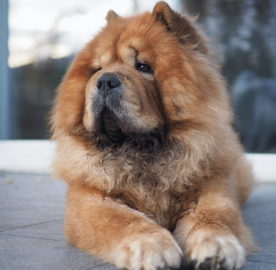
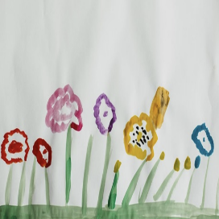
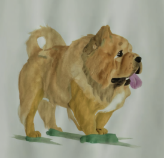

# stable diffusion reference only proposal

## 更加细分职能的参考图像

参考图像进一步分为两类，content reference image 和 style reference image

进而可以支持通用风格迁移的任务，对标ZipLoRA的效果

给定任意真人图像，给定目标风格，保持人物ID

| content reference                                            | style reference                                              | blueprint    | result                                                       |
| ------------------------------------------------------------ | ------------------------------------------------------------ | ------------ | ------------------------------------------------------------ |
|  |  | result的草图 |  |

实现方式初步准备使用Sequential  Large Vision Model作为UNet 的Cross Attention的context实现通用注入，使用三种数据集进行联合训练：

- 相同风格，不同内容的图片集
- 相同内容，不同风格的图片集
- 相同风格，相同内容，不同视觉结构的图片集

假设Sequential  Large Vision Model具有足够通用的细粒度视觉特征，包含风格内容信息，引入两个image encoder的lora进行功能解藕实现精确控制，在同一loss下与UNet进行联合训练：

- style enhanced lora

  当使用该lora推理时，编码特征只会包含风格信息

- content enhanced lora

  当使用该lora推理时，编码特征只会包含内容信息

loss灵感来自ZipLoRA：
$$
\mathcal{L}=||D(x_c,p_c)-(D\oplus L_c)(x_c,p_c)||^2 \\
+||D(x_s,p_s)-(D\oplus L_s)(x_s,p_s)||^2 \\
+||\epsilon-\epsilon_\theta(x_t,t,c_b,c_p)||^2
$$

- $\oplus$：lora矩阵和原矩阵的合并方法
- D：image encoder的原QWV矩阵（层）
- $L$：lora矩阵
- D为原image encoder的Q，W，V矩阵
- s，c下标代表style和content，b代表blueprint，m代表merge

image encoder分别融合两种lora矩阵进行编码得到的style embeds和content embeds在第一纬度进行concat

## 支持多个内容参考图像

比如blueprint有多个人物，可以接受多个人物参考图像并合成到blueprint，保持ZipLoRA的效果

多个content reference 的embeds在第一纬度concat

## 支持三维生成

- 给定多视角图，生成目标mesh
- 给定多视角图，给定目标mesh，生成材质
