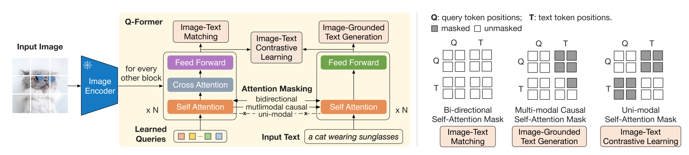

## BLIP2

使用q-former（bert+额外的cross attention+query)连接image encoder个llm，实现图像标记，问答任务

- query是一个参数，因为image embeds是新增的cross attention层注入bert的，所以把输入做成参数，利用bert提取和text encoder对齐的图像特征

### 训练

联合优化三个共享相同输入的目标

- Image-Text Contrastive Learning（ITC）

  对齐图像文本表示已使他们的相互信息最大化，通过正负样本的对比学习实现

  将来自 image transformer的 query representation Z与来自text transformer的text representation t 对齐

  t是[CLS] token

- Image-grounded Text Generation （ITG）

  self-attention 对未来token mask，保证text encoder的编码预测生成能力
  
- Image-Text Matching （ITM）

  将每个Z用一个二元分类器分隔，获得一个logit，保证bert的image encoder嵌入与原文本解析能力

image caption任务使用 a photo of作为llm的输入

visual question Answering使用标记的VQA data，也是直接作为llm的输入预测