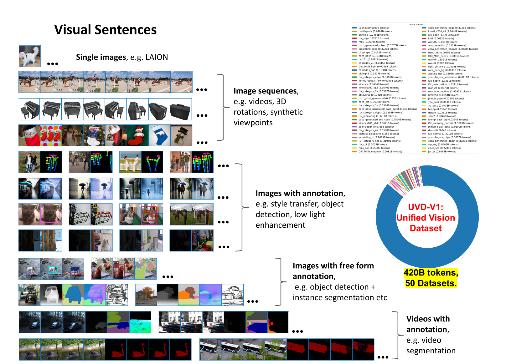

# sequential vision model

## 训练数据

训练数据为图像序列：

- 单一图像来源

  - 来自LAION 5B的过滤子集+EOS组成的序列

    {image,EOS}

- 图像序列来源

  - 从视频数据在（10，20，30）步幅随机抽取形成的16帧的视觉句子

  - Objaverse数据集以不同视角下3D对象的图像序列

    1.5-2.2的相机距离，-45~45的仰角度数，15度为步长渲染24个视图作为序列，总共渲染了42000个这样的序列，8000个用于测试

  - ImageNet中同一类别的一组图像作为一个序列

- 带注释图像来源

  对以下所有批注类型，将9对相同批注类型的图像拼接成16张图像的序列

  - 对象检测

    原图+对每个对象周围覆盖一个颜色编码的边界框的图

  - Human Pose

    遵循OpenPose格式，使用MMPose Depth Estimation Surface Normal Edge Detection，给定ImageNet和COCO图像，

  - Style Transfer，De-noise，Low Light Enhancement， Stereo Datasets

    image pairs数据

  - Colorization

    ImageNet图像转换为灰度，产生图像对

  - Inpainting

    随机添加黑盒，模拟腐败

- 带注释的序列来源

  连接注释和帧

## 训练方法

### 训练image toeknizer

使用由VQGAN模型生成的256个离散的语义标记，在LAION 5B的1.5B子集上训练

### 训练视觉句子自回归模型

每个图像会转换为(1,256)的标记序列，使用LLMA的Transformer体系结构，4096个token的context dim