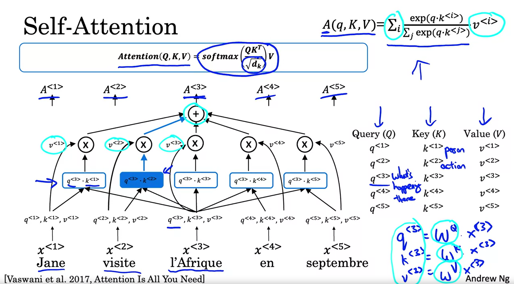
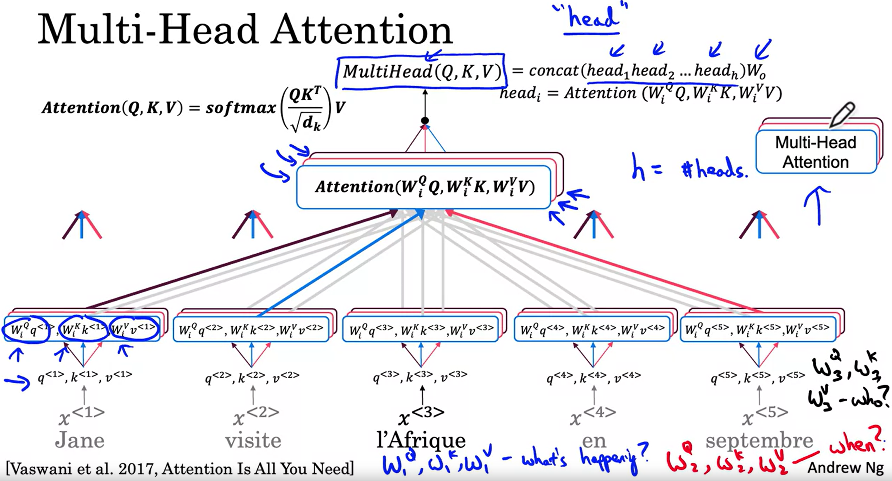
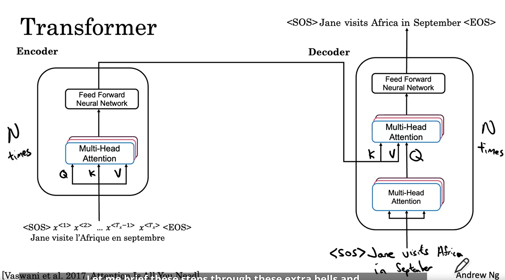
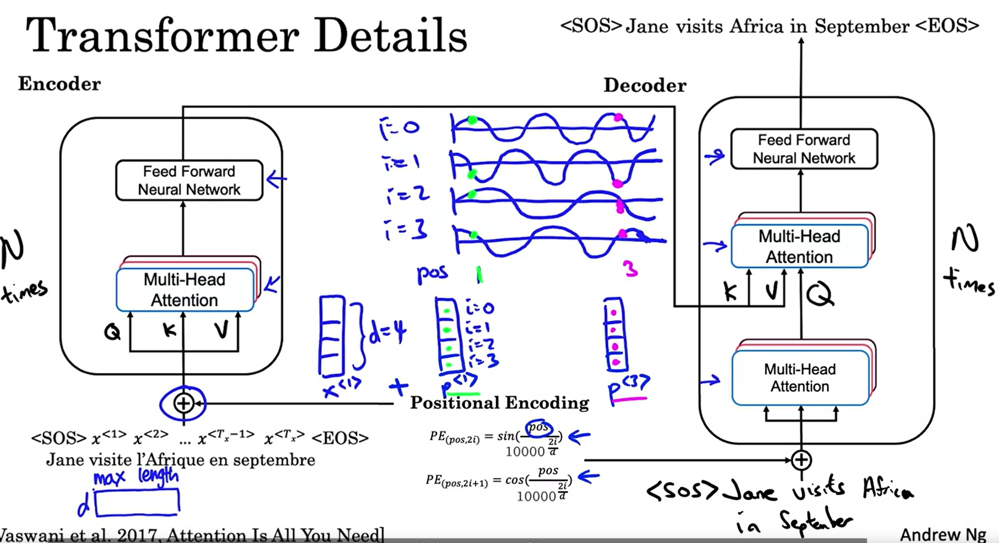

# Transformers Network

## Self-Attention Intuition



每个单词计算$A(q,K,V)$基于注意力的向量（attention-based vector representation of a word）

得到$A^{<1>},...,A^{<t>}$
$$
A(q,K,V)=\sum_i\frac{exp(q\cdot k^{<i>})}{\sum_j exp(q\cdot k^{<j>})}v^{<i>} \\
q^{<i>}=W^Q\cdot x^{<i>}\\
k^{<i>}=W^K\cdot x^{<i>}\\
v^{<i>}=W^V\cdot x^{<i>}\\
$$
其中$q^{<i>}$代表query，如单词i发生了什么，$q^{<i>}\cdot k^{<j>}$通过相似性代表了单词j能回答该问题的置信度，$v^{<i>}$代表该问题的答案，问题的属性


有另一种写法,并称之为scaled dot-product attention
$$
Attention(Q,K,V)=softmax(\frac{QK^T}{\sqrt{d_k}})V
$$
## Multi-Head Attention



有多个类似Self-Attention的结构，并新增一层参数层变换q，k，v，最终将多个attention串行在一起

## Transformer



### 位置信息编码



## Add Norm


## Masked Multi-Head Attention

在测试训练时期，屏蔽Decoder输入的后面一部分，看神经网络是否能够准确预测序列中的下一个单词

## 位置编码

$$
\theta(pos,i,d)=\frac{pos}{10000^{\frac{2i}{d}}}
$$

- d为单词编码以及位置编码的维度
- pos为单词的位置
- k=range(0,d),i=k//2

## Mask

### Padding Mask

transformer有最大可处理序列长度，超出最大长度将被截断，不满最大长度将被补0，然而这些0会影响softmax的计算，根据softmax，我们希望补充的部分概率为0，x为极小值

### Look-ahead Mask

假装预测一部分输出，并观察是否会预测下一段输出

## 并行化实现

记

num_heads为注意力头数

embedding_dim为单词k，v，q维度数

因此最终生成的句子注意力编码结果维度为embedding_dim/num_heads

以词为单位

### 计算K,V,Q矩阵所需要的层

使用Dense层：

- to_q(embedding_dim)
- to_w(embedding_dim)
- to_v(embedding_dim)

配置均为：

参数大小(bs,word_embedding_dim,embedding_dim)

输入为(bs,txt_len,word_embedding_dim)

输出为(bs,txt_len,embedding_dim)

### 计算Q,K,V

使用reshape分解为多头shape，(bs，n_heads，txt_len，head_dim)

q,v需要Permute((2,1,3))，即分解后的shape为(bs，n_heads，txt_len，head_dim),每一行为一个词的q，v向量

而k需要Permute((2,3,1))，即分解后的shape为(bs，n_heads，head_dim，txt_len),每一列为一个词的k向量

### 计算W

w=q@k*head_dim**-0.5

若含有mask（bs，1，txt_len，txt_len），行向量代表单词的忽略向量（单词i忽略单词j则mask[i][j]=-inf），则可以w=w+mask实现mask机制

w=softmax(w)

用一个词的q向量点乘其他词的k向量得到该词的询问权重

因此结果shape为（bs，n_head，txt_len，txt_len）

行向量为单词i的询问权重向量

### 计算结果A

A=w@v

用一个词的w向量点乘其他词的v向量，得到该词意义向量

结果shape为 (bs，n_heads，txt_len，head_dim)

最终将结果reshape会（bs，txt_len，n_heads，head_dim）

### tensorflow示例代码

```python
class CrossAttention(keras.layers.Layer):
    def __init__(self, n_heads, d_head):
        super().__init__()
        self.to_q = keras.layers.Dense(n_heads * d_head, use_bias=False)
        self.to_k = keras.layers.Dense(n_heads * d_head, use_bias=False)
        self.to_v = keras.layers.Dense(n_heads * d_head, use_bias=False)
        self.scale = d_head**-0.5
        self.num_heads = n_heads
        self.head_size = d_head
        self.to_out = [keras.layers.Dense(n_heads * d_head)]

    def call(self, inputs):
        assert type(inputs) is list
        if len(inputs) == 1:
            inputs = inputs + [None]
        x, context = inputs
        context = x if context is None else context
        q, k, v = self.to_q(x), self.to_k(context), self.to_v(context)
        assert len(x.shape) == 3
        q = tf.reshape(q, (-1, x.shape[1], self.num_heads, self.head_size))
        k = tf.reshape(k, (-1, context.shape[1], self.num_heads, self.head_size))
        v = tf.reshape(v, (-1, context.shape[1], self.num_heads, self.head_size))

        q = keras.layers.Permute((2, 1, 3))(q)  # (bs, num_heads, time, head_size)
        k = keras.layers.Permute((2, 3, 1))(k)  # (bs, num_heads, head_size, time)
        v = keras.layers.Permute((2, 1, 3))(v)  # (bs, num_heads, time, head_size)

        score = td_dot(q, k) * self.scale
        weights = keras.activations.softmax(score)  # (bs, num_heads, time, time)
        attention = td_dot(weights, v)
        attention = keras.layers.Permute((2, 1, 3))(
            attention
        )  # (bs, time, num_heads, head_size)
        h_ = tf.reshape(attention, (-1, x.shape[1], self.num_heads * self.head_size))
        return apply_seq(h_, self.to_out)
```

