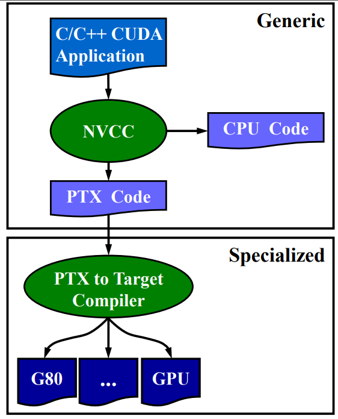

# CUDA

## GPU架构

- SM

- kernel

  执行单元（函数）

- Block

  每个线程块的大小,有自己的共享内存，用于在线程块内的不同线程间共享数据

  有多个Warp

  - Warp

    线程组，调度的最小单位

### 内存

1. 全局内存（Global Memory）：全局内存是GPU中最大的内存池，可用于存储大量的数据，并且可以在CPU和GPU之间进行数据传输。全局内存通常是较慢的，因为它位于GPU芯片之外，需要通过PCIe总线与CPU进行通信。
2. 共享内存（Shared Memory）：共享内存是在GPU中各个线程块之间共享的内存，它的访问速度比全局内存快得多。共享内存通常用于存储一些需要频繁访问的数据，例如线程块之间的协同计算。
3. 常量内存（Constant Memory）：常量内存是一种只读内存，用于存储在GPU执行期间不会发生变化的数据，例如常量数组或者常量结构体等。
4. 纹理内存（Texture Memory）：纹理内存是一种特殊类型的只读内存，主要用于图像或者纹理数据的高效访问。
5. 寄存器（Registers）：寄存器是GPU中最快的内存类型，用于存储每个线程的私有数据。每个线程都拥有自己的一组寄存器，可以用于临时存储计算过程中的数据。
6. 局部内存（Local Memory）：局部内存是在每个线程块内部分配的内存，用于存储线程块内部的临时变量。局部内存通常是较小的，因此不适合存储大量的数据

## kenel调用

kernelFunc<<<nB,nT,nS,Sid>>>(…)

- nB

  每个grid执行多少个block

- nT

  每个block执行多少个线程

- nS

  共享内存大小（字节）

- Sid

## Function限定符

- global

  GPU上运行，CPU上调用

- device

  运行在gpu上，并只能从gpu上调用

- host

  CPU上运行，只能在CPU上调用

## 内存操作

### cudaMalloc()

### cudaFree()

### cudaMemcpy()

```c
cudaMemcpy(void *dst, const void *src, 
size_t count, enum cudaMemcpyKind kind)
```

cudaMemcpyKind:

- cudaMemcpyHostToHost
- cudaMemcpyHostToDevice
- cudaMemcpyDeviceToHost
- cudaMemcpyDeviceToDevice

## 编译

使用NVCC编译，生成中间代码PTX，再由PTX编译为目标平台的二进制文件



## 同步

CPU和GPU间的同步

大多数cuda函数都是异步的：

- Kernel启动
- 异步内存操作
- 同一设备上的内存操作
- 64kB以下的HostToDevice cudaMemcpy
- cudaEvent

同步方式基本分为：

- Device based
- Context based
- Stream based
- Event based

### __syncthreads

