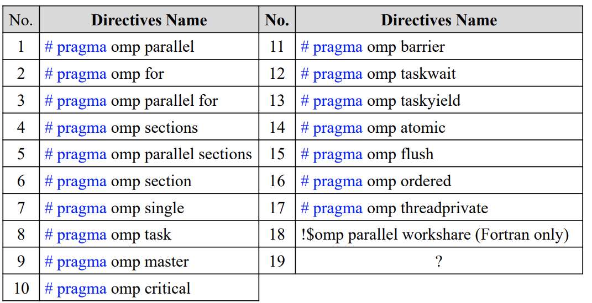
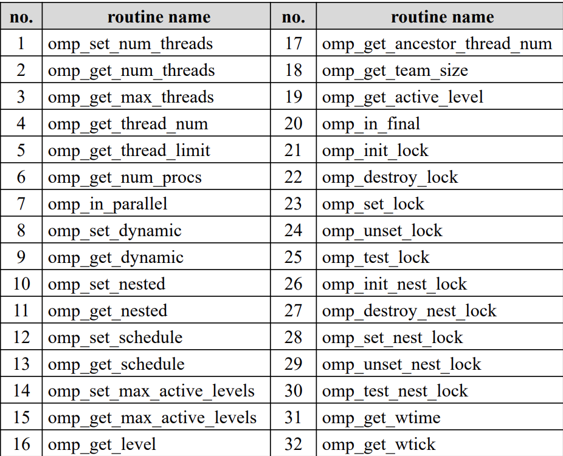
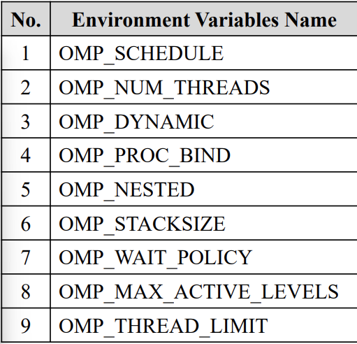
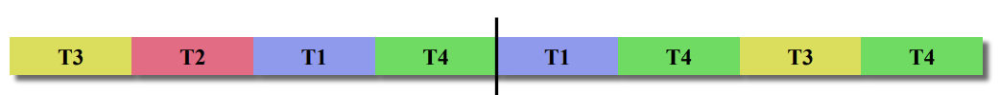

# OpenMP

```shell
gcc  −Wall −fopenmp −o omp_hello omp_hello.c
```

## 预处理命令



## 运行时库



## 环境变量




## parallel

```C
# pragma omp parallel num_threads(thread_count)
```

以thread_count个线程执行

### reduction

```c
int i, prod = 1;
    #pragma omp parallel for reduction(*:prod)
    for (i = 1; i <= 10; i++) {
        prod *= i;
    }
```

对指定的变量进行归约操作，即将多个线程中的同名变量值合并为一个值。

### for

每一轮的代码随机分配给一个线程执行

#### Schedule

并行任务划分

- Type

  - Static

    静态分配，每次线程分配chunksize轮

  - dynamic

    平均分配，能者多劳

    

  - guided

    能者多劳，初始块大小为总圈数除线程数，执行完毕后块大小除二，最小为1

  - runtime

    运行时设置OMP_SCHEDULE

- chunksize

### 并发控制

#### critical

```c
# pragma omp critical
```

同一时刻只有一个线程执行下面的结构块

#### atomic

原子操作

### 变量作用域

- shared scope

  所有线程可访问

  在parallel块前默认是shared

- private scope

  只有一个线程可以访问

  在parallel block内默认是private


```c
# pragma omp parallel for num_threads(thread_count) \
default(none) reduction(+:sum) private(k, factor) \
shared(n)
```


可以在开始并行使用private，shared子句重新生成变量并修改作用域

可以使用default(none)强制必须标志每一个变量的作用域

