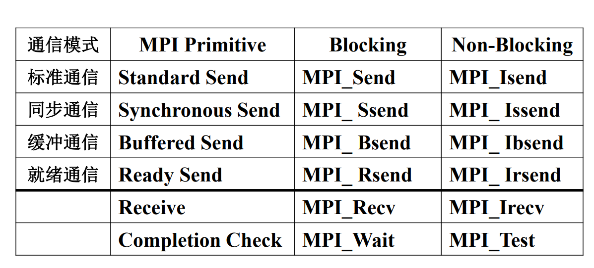

# MPI

## 分配相关资源

```c
int MPI_Init(
int* argc_p /* in/out */,
char*** argv_p /* in/out */);
```


## 回收资源

```python
int MPI_Finalize(void);
```

## 通信子

一个可以收发消息的进程集合，定义为：

MPI_COMM_WORLD

## 获取相关参数

```C
int MPI_Comm_size(
MPI_Comm comm /* in */,
int* comm_sz_p /* out */);
```


```c
int MPI_Comm_rank(
MPI_Comm comm /* in */,
int* my_rank_p /* out */);
```

## 类型


### 自定义类型

#### 创建

```c
int MPI_Type_create_struct (
int count /* in */,
int array_of_blocklengths[] /* in */,
MPI_Aint array_of_displacements[] /* in */,
MPI_Datatype array_of_types[] /* in */,
MPI_Datatype* new_type_p /* out */);
```

#### 提交

```c
int MPI_Type_commit(MPI_Datatype* new_mpi_t_p /* in/out */)
```

#### 释放

```c
int MPI_Type_free(MPI_Datatype* old_mpi_t_p /* in/out */);
```

#### 示例

```c
void Build_mpi_type(
double* a_p /* in */,
double* b_p /* in */,
int* n_p /* in */,
MPI_Datatype* input_mpi_t_p /* out */) {
int array_of_blocklengths[3] = {1, 1, 1};
MPI_Datatype array_of_types[3] = {MPI_DOUBLE, 
MPI_DOUBLE, MPI_INT};
MPI_Aint a_addr, b_addr, n_addr;
MPI_Aint array_of_displacements[3] = {0};

99
Get_input function with a derived datatype (2)
MPI_Get_address(a_p, &a_addr);
MPI_Get_address(b_p, &b_addr);
MPI_Get_address(n_p, &n_addr);
array_of_displacements[1] = b_addr - a_addr;
array_of_displacements[2] = n_addr - a_addr;
MPI_Type_create_struct(3, array_of_blocklengths,
array_of_displacements, array_of_types,
input_mpi_t_p);
MPI_Type_commit(input_mpi_t_p); /*派生出的新数据类型，必须
先要经过MPI系统的确认后才能使用。*/
} 
```


## 通信方法

### Send

发送完即执行下一个指令

```C
int MPI_Send(
void* msg_buf_p /* 消息地址 */,
int msg_size /* 消息个数 */,
MPI_Datatype msg_type /* 消息数据类型 */,
int dest /* 接受进程标识号 */,
int tag /* 消息标签 */,
MPI_Comm communicator /* 通信子 */);
```

### sSend

确认对方接收完才执行

### Recv

```C
int MPI_Recv(
void* msg_buf_p /* 接受消息地址 */,
int buf_size /* in */,
MPI_Datatype buf_type /* in */,
int source /* in */,
int tag /* in */,
MPI_Comm communicator /* in */,
MPI_Status* Status_p /* out */);
```

### Sendrecv

```c
int MPI_Sendrecv(
void* send_buf_p /* in */,
int send_buf_size /* in */,
MPI_Datatype send_buf_type /* in */,
int dest /* in */,
int send_tag /* in */,
void* recv_buf_p /* out */,
int recv_buf_size /* in */,
MPI_Datatype recv_buf_type /* in */,
int source /* in */,
int recv_tag /* in */,
MPI_Comm communicator /* in */,
MPI_Status* status_p /* in */);

```


- MPI_Status
  - status.MPI_SOURCE
  - status.MPI_TAG
  - status.MPI_ERROR

```c
int MPI_Get_count(
MPI_Status* Status_p /* in */,
MPI_Datatype type /* in */,
int* count_p /* out */);
```

## 通信模式



## 集体函数

### reduce

```c
int MPI_Reduce(
void* input_data_p /* in */,
void* output_data_p /* out */,
int count /* in */,
MPI_Datatype datatype /* in */,
MPI_Op operator /* in */,
int dest_process /* in */,
MPI_Comm comm /* in */);
```


```c
int MPI_Allreduce(
void* input_data_p /* in */,
void* output_data_p /* out */,
int count /* in */,
MPI_Datatype datatype /* in */,
MPI_Op operator /* in */,
MPI_Comm comm /* in */);

```

### 广播

```c
int MPI_Bcast(
void* data_p /* in/out */,
int count /* in */,
MPI_Datatype datatype /* in */,
int source_proc /* in */,
MPI_Comm comm /* in */);

```

### Scatter

```c
int MPI_Scatter(
void* send_buf_p /* 根进程要发送的数据的缓冲区 */,
int send_count /* 发送元素个数 */,
MPI_Datatype send_type /* 数据类型 */,
void* recv_buf_p /* 每个进程接受的数据地址 */,
int recv_count /* 接受缓冲区中的元素个数 */,
MPI_Datatype recv_type /* 接收缓冲区中的元素类型 */,
int src_proc /* 发送进程的排名 */,
MPI_Comm comm /* in */);
```

将一个成员中的数据分散到组的所有成员中。

### Gather

将数据从组的所有成员收集到一个成员。

```c
int MPI_Gather(
void* send_buf_p /* 指向包含要发送到根进程的数据的缓冲区的指针 */,
int send_count /* in */,
MPI_Datatype send_type /* in */,
void* recv_buf_p /* out */,
int recv_count /* 根进程排名 */,
MPI_Datatype recv_type /* 缓冲区中每个元素的 MPI 数据类型 */,
int dest_proc /* in */,
MPI_Comm comm /* in */)
```

### Allgather

```c
int MPI_Allgather(
void* send_buf_p /* in */,
int send_count /* in */,
MPI_Datatype send_type /* in */,
void* recv_buf_p /* out */,
int recv_count /* in */,
MPI_Datatype recv_type /* in */,
MPI_Comm comm /* in */)
```

### Alltoall

```c
int  MPI_Alltoall(
    	void         *sendbuf,
        int          sendcount,
        MPI_Datatype sendtype,
  		void         *recvbuf,
        int          recvcount,
        MPI_Datatype recvtype,
        MPI_Comm     comm
);
```

### 同步

```c
int MPI_Barrier(MPI_Comm comm /* in */);
```


## 数学运算

### 矩阵乘法

```c
void Mat_vec_mult(
double local_A[] /* in */,
double local_x[] /* in */,
double local_y[] /* out */,
int local_m /* in */,
int n /* in */,
int local_n /* in */,
MPI_Comm comm /* in */) 
```

