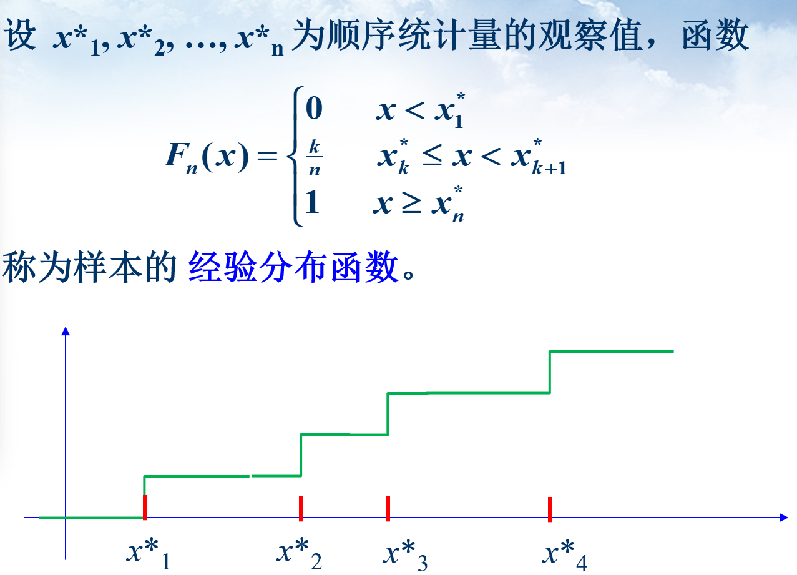
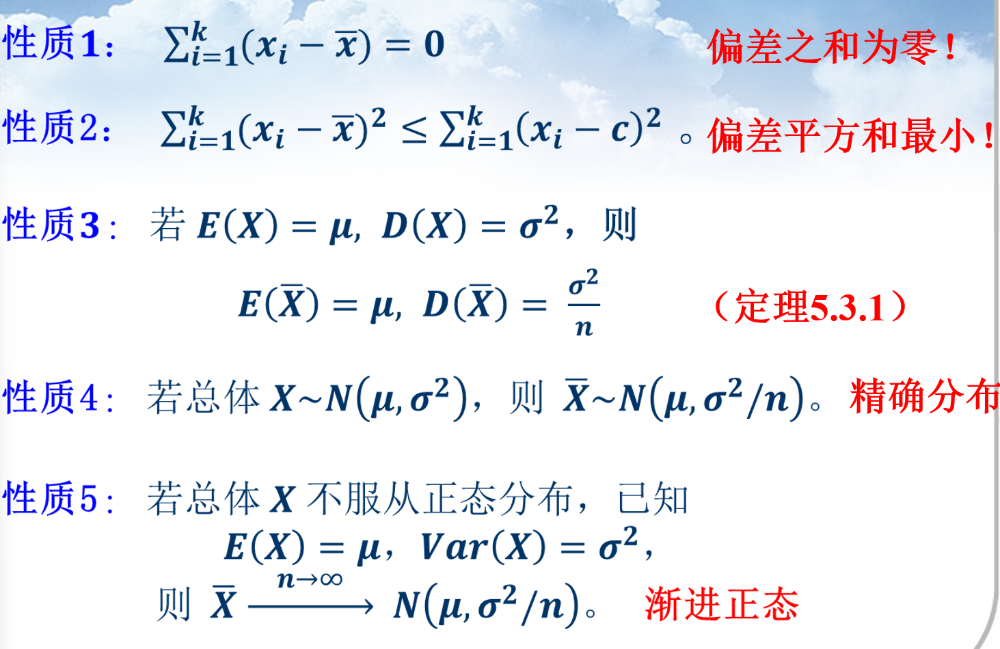
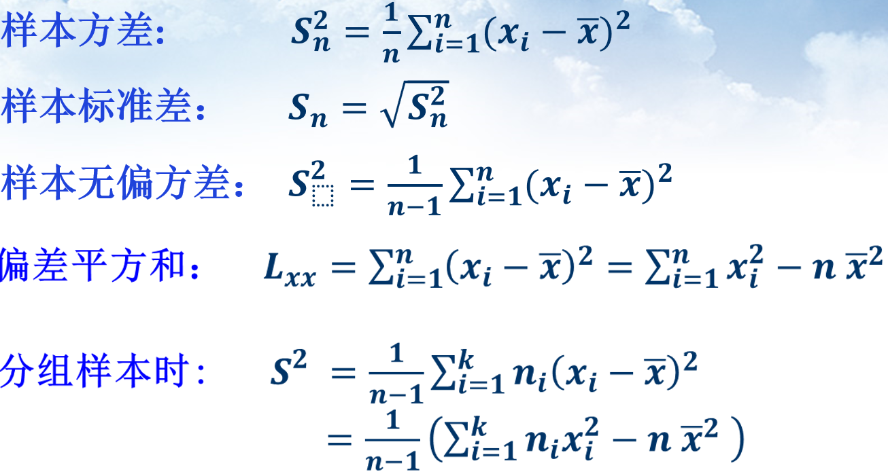

# 样本分布

## 描述性样本统计量

- 顺序统计量

  - 极大/极小 统计量
  - 样本中位数
  - 样本极差

- 经验分布函数

  

## 格里汶科（Glivenko）定理

当n充分大时，样本分布函数近似等于总体分布函数

## 样本均值及性质

关于性质3，4，5，假设样本数量无限大，包含全部可采集的样本，他们的均值是一样的，因此方差是00。
$$
D(\bar X)=D(\frac{1}{n}\sum_{i=1}^n x_i)=\frac{1}{n^2}D(\sum_{i=1}^n x_i)=\frac{1}{n}D(X)
$$

## 样本方差及性质

## 均匀分布

方差：$D(X)=\frac{(b-a)^2}{12}$

## 正态分布

$$
p(x)=\frac{1}{\sigma\sqrt{2\pi}}exp(-\frac{(x-\mu)^2}{2\sigma^2})
$$

### 运算

$$
N(0,\sigma^2_1I)+N(0,\sigma^2_2I) \sim N(0,(\sigma^2_1+\sigma^2_2)I)
$$

### 高斯分布的性质

1. 对称性：高斯分布是关于均值 $\mu$ 对称的，即 $p(\mu-x) = p(\mu+x)$。
2. 中心极限定理：多个独立同分布的随机变量的和，当样本数量足够大时，近似服从高斯分布。
3. 线性组合：多个高斯分布的线性组合仍然是一个高斯分布。如果 $X_1 \sim N(\mu_1, \sigma_1^2)$，$X_2 \sim N(\mu_2, \sigma_2^2)$ 是两个独立的高斯分布，那么 $aX_1+bX_2 \sim N(a\mu_1+b\mu_2, a^2\sigma_1^2+b^2\sigma_2^2)$ 也是一个高斯分布。
4. 最大值和最小值：多个独立同分布的随机变量的最大值和最小值，当样本数量足够大时，近似服从极值分布，是一个近似高斯分布。
5. 最小二乘法：在最小二乘法中，高斯分布被广泛地应用于回归问题中的误差项。
6. 熵：高斯分布的熵为 $\frac{1}{2}\log(2\pi e\sigma^2)$，其中 $e$ 是自然对数的底数。高斯分布的熵表明了随机变量的不确定性。当方差越大时，熵也越大。

## $\mathcal{x^2}$分布

$X_i$是相互独立的随机变量，且$X_i \sim N(0,1)$，则称随机变量
$$
\mathcal{x}^2=X_1^2+...+X_n^2
$$
服从自由度为n的$X^2$分布，密度函数为

## 