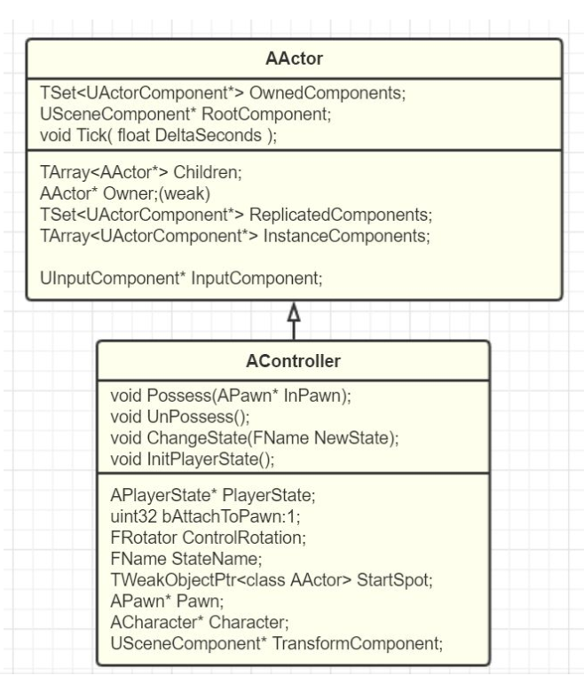
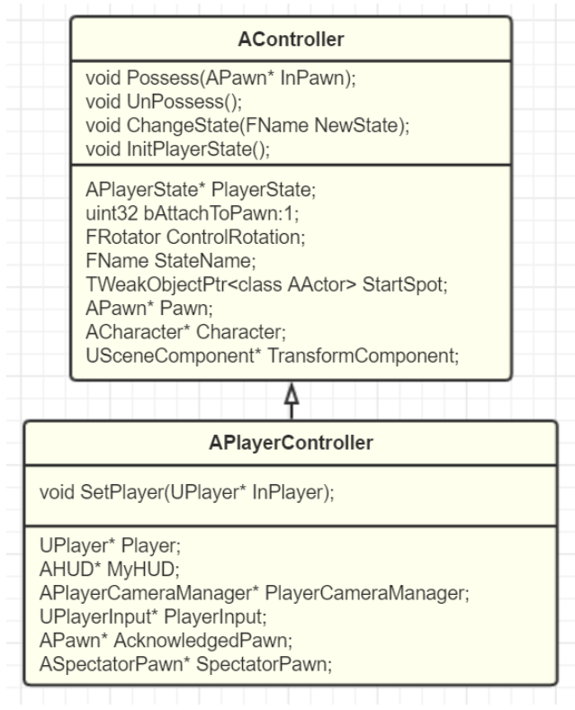
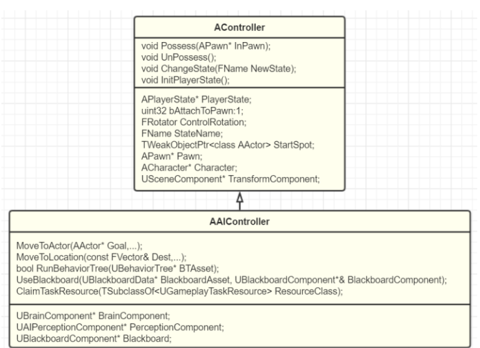

## Controller

- 能够和Pawn对应起来
- 多个控制实例
- 可挂载释放
- 能够脱离Pawn存在
- 操纵Pawn生死的能力
- 根据配置自动生成
- 事件响应
- 持续的运行
- 自身有状态
- 拥有一定的扩展组合继承能力
- 保存数据状态
- 可在世界里移动
- 可探查世界对象
- 可同步

## 功能

- 决策类，而非决策行为的实现
- 可用于多个Pawn的通用逻辑
- 维护Pawn，因为生命周期长于Pawn

### PlayerController

#### 功能

- Camera的管理，通过PlayerCameraManager这一个关联的很紧密的摄像机管理类

- Input系统，包括构建InputStack用来路由输入事件。

  也包括了自己对输入事件的处理，包含了UPlauerInput来委托处理

- UPlayer关联，可以是本例的（LocalPlayer），也可以是网络控制的（UNetConnection）。PlayerController只有在SetPlayer后，才可以正常工作

- HUD显示

- Level的切换

  PlayerController作为网络中的通道，在一起进行LevelTravelling的时候，也都是通过PlayerController来进行RPC调用，然后由PlayerController来转发到自己的World中来实际进行

- Voice，也是为了方便网络中语音聊天的一些控制函数

## AIController

较PlayerController减少了Camera，Input，UPlayer关联，HUD显示，Voice，level切换接口。

- Navigation

  MoveTo控制移动位置

  SetFocus控制朝向

- AI组件

  行为树，使用黑板数据

- Task系统

  实现GameplayAbilities系统的一个接口

  GameplayAbilities：为Actor添加额外能力属性集合的模块
