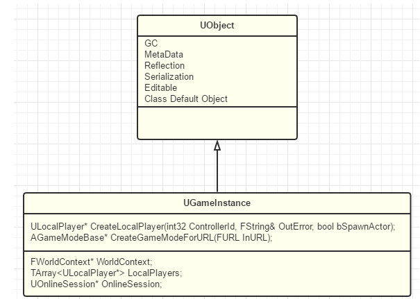
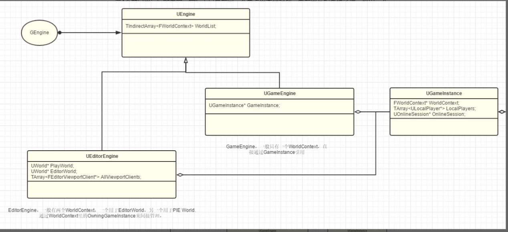

# GameInstance





应该放于GameInstance的逻辑

- Worlds，level控制
- Players
- UI
- 全局配置
- 游戏额外的第三方逻辑

## SaveGame

```cpp
UCLASS(abstract, Blueprintable, BlueprintType)
class ENGINE_API USaveGame : public UObject
{
	/**
	 *	@see UGameplayStatics::CreateSaveGameObject
	 *	@see UGameplayStatics::SaveGameToSlot
	 *	@see UGameplayStatics::DoesSaveGameExist
	 *	@see UGameplayStatics::LoadGameFromSlot
	 *	@see UGameplayStatics::DeleteGameInSlot
	 */

	GENERATED_UCLASS_BODY()
};
```

