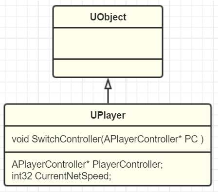
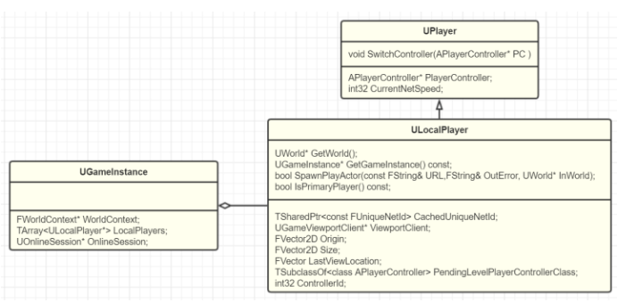

# Player



UE引擎通过UPlayer把输入和PlayerController关联起来。

## ULocalPlayer



```cpp
ULocalPlayer* UGameInstance::CreateLocalPlayer(int32 ControllerId, FString& OutError, bool bSpawnActor)
{
	ULocalPlayer* NewPlayer = NULL;
	int32 InsertIndex = INDEX_NONE;
	const int32 MaxSplitscreenPlayers = (GetGameViewportClient() != NULL) ? GetGameViewportClient()->MaxSplitscreenPlayers : 1;
    //已略去错误验证代码，MaxSplitscreenPlayers默认为4
	NewPlayer = NewObject<ULocalPlayer>(GetEngine(), GetEngine()->LocalPlayerClass);
	InsertIndex = AddLocalPlayer(NewPlayer, ControllerId);
	if (bSpawnActor && InsertIndex != INDEX_NONE && GetWorld() != NULL)
	{
		if (GetWorld()->GetNetMode() != NM_Client)
		{
			// server; spawn a new PlayerController immediately
			if (!NewPlayer->SpawnPlayActor("", OutError, GetWorld()))
			{
				RemoveLocalPlayer(NewPlayer);
				NewPlayer = NULL;
			}
		}
		else
		{
			// client; ask the server to let the new player join
			NewPlayer->SendSplitJoin();
		}
	}
	return NewPlayer;
}
```

SpawnPlayerActor创建playcontroller

- server模式，直接创建出对应的PlayerController
- client中，则会先发送JoinSplit消息到服务器，载入服务器上的Map后再为LocalPlayer创建出PlayerController

创建playercontroller中调用InitPlayerState（）

```cpp
void APlayerController::SetPlayer( UPlayer* InPlayer )
{
    //[...]
	// Set the viewport.
	Player = InPlayer;
	InPlayer->PlayerController = this;
	// initializations only for local players
	ULocalPlayer *LP = Cast<ULocalPlayer>(InPlayer);
	if (LP != NULL)
	{
		// Clients need this marked as local (server already knew at construction time)
		SetAsLocalPlayerController();
		LP->InitOnlineSession();
		InitInputSystem();
	}
	else
	{
		NetConnection = Cast<UNetConnection>(InPlayer);
		if (NetConnection)
		{
			NetConnection->OwningActor = this;
		}
	}
	UpdateStateInputComponents();
	// notify script that we've been assigned a valid player
	ReceivedPlayer();
}
```

